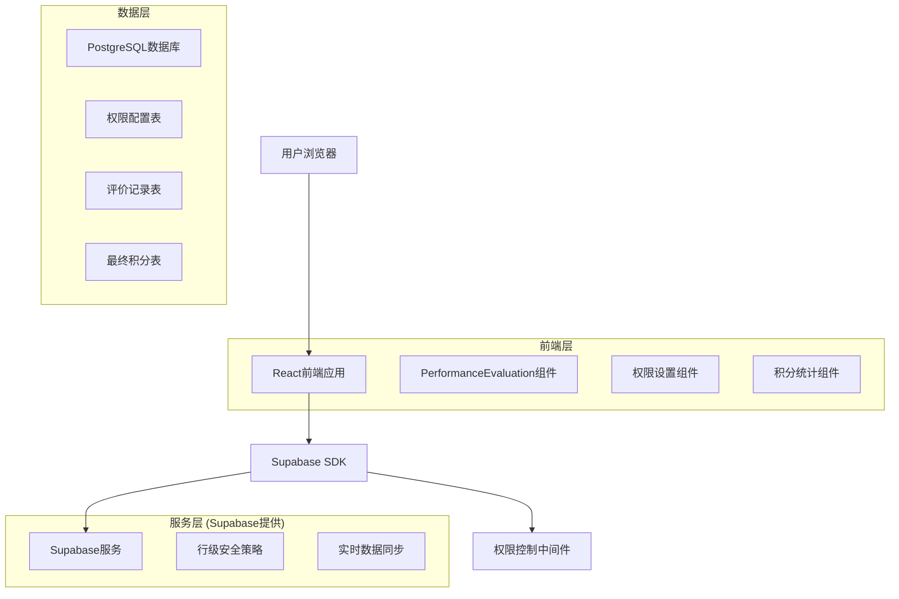
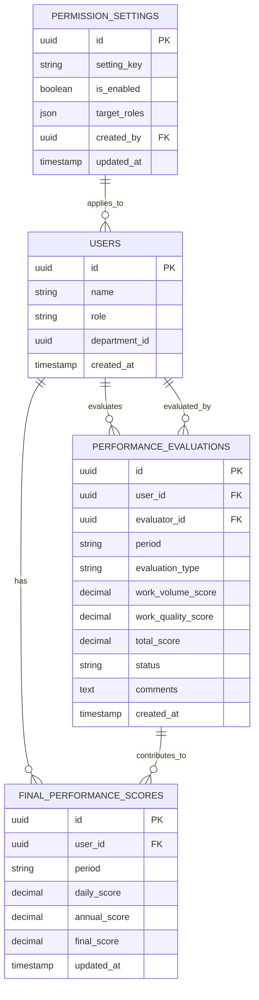

# 工作实绩积分模块技术架构文档

## 1. 架构设计



## 2. 技术描述

- **前端**: React@18 + TypeScript + Ant Design + Tailwind CSS + Vite
- **后端**: Supabase (PostgreSQL + 实时API + 认证)
- **状态管理**: Zustand
- **图表库**: Recharts
- **日期处理**: Day.js

## 3. 路由定义

| 路由 | 用途 |
|------|------|
| /performance-evaluation | 工作实绩评价主页面，包含日常评价和年终测评 |
| /performance-evaluation/daily | 日常实绩评价管理页面 |
| /performance-evaluation/annual | 年终集体测评页面 |
| /performance-evaluation/statistics | 积分统计分析页面 |
| /performance-evaluation/settings | 权限设置页面（仅管理员可见） |
| /performance-evaluation/personal | 个人积分查看页面 |

## 4. API定义

### 4.1 核心API接口

**日常实绩评价相关**

```typescript
// 创建日常评价记录
POST /api/performance-evaluations
```

请求参数：
| 参数名 | 参数类型 | 是否必需 | 描述 |
|--------|----------|----------|------|
| user_id | string | true | 被评价人ID |
| period | string | true | 评价周期(YYYY-MM格式) |
| work_volume_score | number | true | 工作任务量得分(0-30) |
| work_quality_score | number | true | 工作完成质效得分(0-20) |
| comments | string | false | 评价意见 |
| evaluation_type | string | true | 评价类型('daily'或'annual') |

响应参数：
| 参数名 | 参数类型 | 描述 |
|--------|----------|------|
| success | boolean | 操作是否成功 |
| data | object | 创建的评价记录 |
| message | string | 响应消息 |

**权限设置相关**

```typescript
// 更新界面可见性设置
PUT /api/permission-settings
```

请求参数：
| 参数名 | 参数类型 | 是否必需 | 描述 |
|--------|----------|----------|------|
| daily_evaluation_visible | boolean | true | 日常评价界面是否可见 |
| annual_evaluation_visible | boolean | true | 年终测评界面是否可见 |
| target_roles | string[] | false | 目标用户角色 |

**最终积分计算**

```typescript
// 计算最终工作实绩积分
POST /api/calculate-final-scores
```

请求参数：
| 参数名 | 参数类型 | 是否必需 | 描述 |
|--------|----------|----------|------|
| user_id | string | false | 特定用户ID(为空则计算所有用户) |
| period | string | true | 计算周期 |

**积分计算逻辑**：
- 每位普通职工的工作实绩积分 = 所有参加评分测评人员评分测评分数的总和 ÷ 参评人数
- 计算结果精确到小数点后两位
- 最终积分 = 日常实绩评价积分平均值 × 80% + 年终集体测评积分平均值 × 20%

## 5. 数据模型

### 5.1 数据模型定义



### 5.2 数据定义语言

**权限设置表 (permission_settings)**

```sql
-- 创建权限设置表
CREATE TABLE permission_settings (
    id UUID PRIMARY KEY DEFAULT gen_random_uuid(),
    setting_key VARCHAR(100) NOT NULL UNIQUE,
    is_enabled BOOLEAN DEFAULT false,
    target_roles JSONB DEFAULT '[]'::jsonb,
    description TEXT,
    created_by UUID REFERENCES users(id),
    created_at TIMESTAMP WITH TIME ZONE DEFAULT NOW(),
    updated_at TIMESTAMP WITH TIME ZONE DEFAULT NOW()
);

-- 创建索引
CREATE INDEX idx_permission_settings_key ON permission_settings(setting_key);
CREATE INDEX idx_permission_settings_enabled ON permission_settings(is_enabled);

-- 插入初始权限设置
INSERT INTO permission_settings (setting_key, is_enabled, description) VALUES
('daily_evaluation_visible', true, '普通用户日常实绩评价界面可见性'),
('annual_evaluation_visible', true, '普通用户年终集体测评界面可见性'),
('evaluation_result_visible', true, '普通用户评价结果查看权限');
```

**扩展现有performance_evaluations表**

```sql
-- 为performance_evaluations表添加新字段
ALTER TABLE performance_evaluations 
ADD COLUMN IF NOT EXISTS batch_id UUID,
ADD COLUMN IF NOT EXISTS is_anonymous BOOLEAN DEFAULT false,
ADD COLUMN IF NOT EXISTS evaluation_round INTEGER DEFAULT 1;

-- 创建评价批次表
CREATE TABLE evaluation_batches (
    id UUID PRIMARY KEY DEFAULT gen_random_uuid(),
    batch_name VARCHAR(200) NOT NULL,
    evaluation_type VARCHAR(20) NOT NULL CHECK (evaluation_type IN ('daily', 'annual')),
    period VARCHAR(20) NOT NULL,
    status VARCHAR(20) DEFAULT 'active' CHECK (status IN ('active', 'completed', 'cancelled')),
    start_date DATE,
    end_date DATE,
    created_by UUID REFERENCES users(id),
    created_at TIMESTAMP WITH TIME ZONE DEFAULT NOW(),
    updated_at TIMESTAMP WITH TIME ZONE DEFAULT NOW()
);

-- 创建索引
CREATE INDEX idx_evaluation_batches_type ON evaluation_batches(evaluation_type);
CREATE INDEX idx_evaluation_batches_period ON evaluation_batches(period);
CREATE INDEX idx_evaluation_batches_status ON evaluation_batches(status);
```

**行级安全策略**

```sql
-- 启用RLS
ALTER TABLE permission_settings ENABLE ROW LEVEL SECURITY;
ALTER TABLE evaluation_batches ENABLE ROW LEVEL SECURITY;

-- 权限设置表策略
CREATE POLICY "管理员可管理权限设置" ON permission_settings
    FOR ALL USING (
        EXISTS (
            SELECT 1 FROM users 
            WHERE users.id = auth.uid() 
            AND users.role IN ('system_admin', 'assessment_admin')
        )
    );

CREATE POLICY "所有用户可查看权限设置" ON permission_settings
    FOR SELECT USING (true);

-- 评价批次表策略
CREATE POLICY "管理员可管理评价批次" ON evaluation_batches
    FOR ALL USING (
        EXISTS (
            SELECT 1 FROM users 
            WHERE users.id = auth.uid() 
            AND users.role IN ('system_admin', 'assessment_admin', 'leader')
        )
    );

CREATE POLICY "所有用户可查看活跃批次" ON evaluation_batches
    FOR SELECT USING (status = 'active');

-- 扩展现有performance_evaluations表策略
CREATE POLICY "评价人员可创建评价记录" ON performance_evaluations
    FOR INSERT WITH CHECK (
        auth.uid() = evaluator_id AND
        (
            EXISTS (
                SELECT 1 FROM users 
                WHERE users.id = auth.uid() 
                AND users.role IN ('system_admin', 'assessment_admin', 'leader', 'evaluator')
            )
            OR
            -- 普通职工在权限开启时也可以进行评价
            (
                EXISTS (
                    SELECT 1 FROM users 
                    WHERE users.id = auth.uid() 
                    AND users.role = 'employee'
                )
                AND
                EXISTS (
                    SELECT 1 FROM permission_settings 
                    WHERE setting_key IN ('daily_evaluation_visible', 'annual_evaluation_visible') 
                    AND is_enabled = true
                )
            )
        )
    );

CREATE POLICY "用户可查看相关评价记录" ON performance_evaluations
    FOR SELECT USING (
        user_id = auth.uid() OR 
        evaluator_id = auth.uid() OR
        EXISTS (
            SELECT 1 FROM users 
            WHERE users.id = auth.uid() 
            AND users.role IN ('system_admin', 'assessment_admin', 'leader')
        )
    );
```

**授予权限**

```sql
-- 授予基本权限
GRANT ALL PRIVILEGES ON permission_settings TO authenticated;
GRANT ALL PRIVILEGES ON evaluation_batches TO authenticated;
GRANT SELECT ON permission_settings TO anon;
GRANT SELECT ON evaluation_batches TO anon;
```

## 6. 权限控制机制

### 6.1 角色权限矩阵

| 功能 | 系统管理员 | 考核办管理员 | 分管领导 | 指定评价人员 | 普通职工 |
|------|------------|--------------|----------|--------------|----------|
| 设置界面可见性 | ✓ | ✓ | ✗ | ✗ | ✗ |
| 创建日常评价 | ✓ | ✓ | ✓ | ✓ | 可控 |
| 审批评价记录 | ✓ | ✓ | ✗ | ✗ | ✗ |
| 参与年终测评 | ✓ | ✓ | ✓ | ✓ | 可控 |
| 对他人进行评价 | ✓ | ✓ | ✓ | ✓ | 可控 |
| 查看个人积分 | ✓ | ✓ | ✓ | ✓ | ✓ |
| 查看他人积分 | ✓ | ✓ | 部分 | ✗ | ✗ |
| 导出积分报告 | ✓ | ✓ | ✓ | ✗ | ✗ |

### 6.2 界面可见性控制

```typescript
// 权限检查Hook
const usePermissionCheck = () => {
  const { user } = useAuthStore();
  const [permissions, setPermissions] = useState<any>({});
  
  useEffect(() => {
    const checkPermissions = async () => {
      const { data } = await supabase
        .from('permission_settings')
        .select('*')
        .in('setting_key', ['daily_evaluation_visible', 'annual_evaluation_visible']);
      
      const permissionMap = data?.reduce((acc, item) => {
        acc[item.setting_key] = item.is_enabled;
        return acc;
      }, {});
      
      setPermissions(permissionMap);
    };
    
    checkPermissions();
  }, []);
  
  const canAccessDailyEvaluation = () => {
    if (['system_admin', 'assessment_admin', 'leader', 'evaluator'].includes(user?.role)) {
      return true;
    }
    return permissions.daily_evaluation_visible;
  };
  
  const canAccessAnnualEvaluation = () => {
    if (['system_admin', 'assessment_admin'].includes(user?.role)) {
      return true;
    }
    return permissions.annual_evaluation_visible;
  };
  
  return { canAccessDailyEvaluation, canAccessAnnualEvaluation };
};
```

## 7. 性能优化策略

### 7.1 数据库优化

- 为高频查询字段创建复合索引
- 使用数据库函数进行复杂积分计算
- 实现增量更新机制，避免全量重算
- 使用物化视图缓存统计结果

### 7.2 前端优化

- 使用React.memo优化组件渲染
- 实现虚拟滚动处理大量数据
- 使用Suspense和lazy loading优化页面加载
- 缓存权限检查结果，减少重复请求

### 7.3 实时性保障

- 利用Supabase实时订阅功能同步数据变更
- 实现乐观更新提升用户体验
- 使用WebSocket推送重要状态变更通知