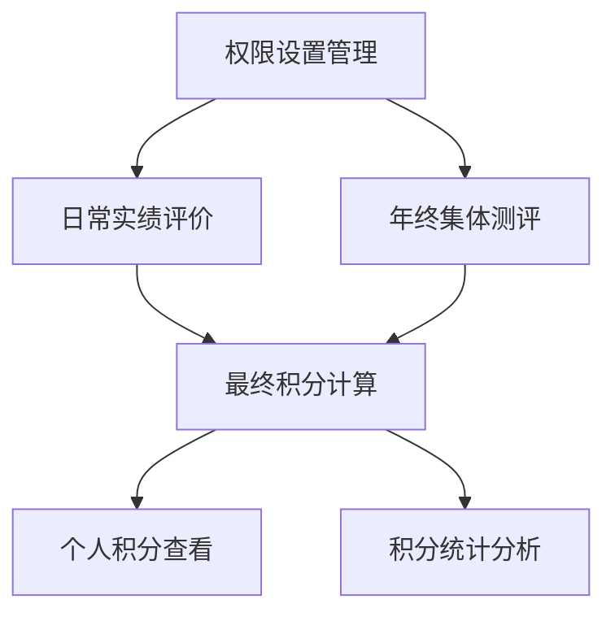

# 工作实绩积分模块设计文档

## 1. 产品概述

工作实绩积分模块是积分制绩效管理系统的核心组成部分，坚持"多干多得、少干少得、不干不得"的原则，通过科学的评价体系对工作人员的实际工作表现进行量化考核。

该模块通过日常实绩评价（80%权重）和年终集体测评（20%权重）相结合的方式，从工作任务量和工作完成质效两个维度进行综合评价，确保评价结果的公平性和准确性。

## 2. 核心功能

### 2.1 用户角色

| 角色 | 权限描述 | 核心功能 |
|------|----------|----------|
| 考核办管理员 | 系统管理权限 | 设置界面可见性、管理评价流程、审批评价结果、统一控制评价权限 |
| 分管领导 | 评价权限 | 进行日常实绩评价、查看下属评价结果 |
| 指定评价人员 | 限定评价权限 | 对指定范围人员进行日常实绩评价 |
| 普通职工 | 评价和查看权限 | 查看个人积分、参与年终集体测评、在管理员权限控制下对其他职工进行日常实绩评价和年终集体测评 |

### 2.2 功能模块

本模块包含以下核心页面：

1. **日常实绩评价管理页面**：评价人员录入和管理日常评价记录，包含工作任务量和质效评分
2. **年终集体测评页面**：全体人员参与的无记名测评界面，支持批量评价
3. **积分统计分析页面**：展示最终积分计算结果和趋势分析
4. **权限设置页面**：考核办管理员控制普通用户界面可见性
5. **个人积分查看页面**：用户查看个人工作实绩积分详情

### 2.3 页面详情

| 页面名称 | 模块名称 | 功能描述 |
|----------|----------|----------|
| 日常实绩评价管理 | 评价录入模块 | 创建、编辑日常评价记录，支持工作任务量(0-30分)和工作完成质效(0-20分)评分 |
| 日常实绩评价管理 | 评价审核模块 | 提交、审核、批准评价记录，支持状态流转管理 |
| 日常实绩评价管理 | 数据统计模块 | 展示月度评价统计、完成率分析、评分分布图表 |
| 年终集体测评 | 测评界面模块 | 提供简洁的无记名测评界面，支持批量评价操作 |
| 年终集体测评 | 结果汇总模块 | 自动计算测评平均分，生成年终测评积分 |
| 积分统计分析 | 最终积分计算 | 按公式计算最终积分：日常评价×80% + 年终测评×20% |
| 积分统计分析 | 趋势分析模块 | 展示个人和部门积分趋势、排名对比分析 |
| 权限设置 | 可见性控制 | 设置普通用户对日常评价和年终测评界面的访问权限 |
| 权限设置 | 评价人员管理 | 指定和管理有评价权限的人员范围 |
| 个人积分查看 | 积分详情展示 | 显示个人日常评价、年终测评和最终积分详情 |
| 个人积分查看 | 历史记录查询 | 支持按时间段查询历史积分记录和变化趋势 |

## 3. 核心流程

### 3.1 日常实绩评价流程

1. 考核办管理员设置评价周期和评价人员范围
2. 分管领导和指定人员登录系统进行月度评价
3. 从工作任务量(0-30分)和工作完成质效(0-20分)两个维度评分
4. 提交评价记录，等待审核批准
5. 系统自动汇总计算日常实绩评价积分

### 3.2 年终集体测评流程

1. 考核办管理员开启年终测评功能
2. 全体工作人员参与无记名集体测评
3. 对所有考核对象进行工作任务量和质效评分
4. 系统自动计算测评平均分作为年终集体测评积分
5. 生成年终测评结果报告

### 3.3 最终积分计算流程

1. 系统获取已批准的日常实绩评价积分
2. 获取年终集体测评积分
3. 按公式计算：最终积分 = 日常评价积分×80% + 年终测评积分×20%
4. **积分计算方式**：每位普通职工的工作实绩积分 = 所有参加评分测评人员评分测评分数的总和 ÷ 参评人数（精确到小数点后两位）
5. 更新用户最终工作实绩积分记录
6. 生成积分统计报告和趋势分析

## 4. 用户界面设计

### 4.1 设计风格

- **主色调**：蓝色系(#1890ff)为主，绿色(#52c41a)为辅助色
- **按钮样式**：圆角按钮，主要操作使用实心按钮，次要操作使用线框按钮
- **字体**：系统默认字体，标题使用16-18px，正文使用14px，辅助信息使用12px
- **布局风格**：卡片式布局，顶部导航，左侧功能菜单
- **图标风格**：使用Ant Design图标库，简洁现代风格

### 4.2 页面设计概览

| 页面名称 | 模块名称 | UI元素 |
|----------|----------|--------|
| 日常实绩评价管理 | 评价表单 | 用户选择器、评分输入框(0-30分、0-20分)、日期选择器、状态标签 |
| 日常实绩评价管理 | 数据表格 | 分页表格、筛选器、操作按钮、状态标识、评分进度条 |
| 年终集体测评 | 测评界面 | 简化评分卡片、批量操作按钮、进度指示器、匿名标识 |
| 积分统计分析 | 统计图表 | 折线图(趋势)、柱状图(对比)、环形图(构成)、数据卡片 |
| 权限设置 | 开关控制 | 切换开关、用户多选器、权限矩阵表格、保存确认按钮 |
| 个人积分查看 | 积分展示 | 积分卡片、计算公式展示、历史趋势图、详情列表 |

### 4.3 响应式设计

系统采用桌面优先的响应式设计，支持平板和移动端适配。评价表单在移动端采用垂直布局，表格支持横向滚动，图表自适应屏幕尺寸。考虑到评价操作的准确性要求，建议主要在桌面端进行评价操作。