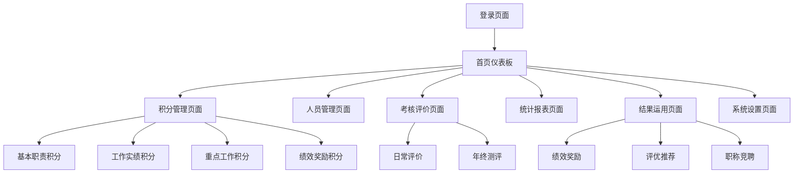

# 积分制绩效管理系统 - 产品需求文档

## 1. 产品概述

积分制绩效管理系统是一个面向机关单位的数字化绩效考核平台，通过量化积分管理实现干部职工绩效评价的科学化、规范化和透明化。

系统基于"马上就办、真抓实干"的工作理念，建立奖优罚劣、奖勤罚懒的良好工作氛围，提升机关工作效能和服务水平。

通过积分制考核结果与绩效奖励、评先评优、职称竞聘等挂钩，激励干部职工担当作为、创先争优。

## 2. 核心功能

### 2.1 用户角色

| 角色 | 注册方式 | 核心权限 |
|------|----------|----------|
| 系统管理员 | 系统预设账号 | 系统配置、用户管理、数据维护 |
| 考核办管理员 | 管理员创建 | 积分录入、统计汇总、督查通报 |
| 分管领导 | 管理员创建 | 工作实绩评价、重点工作评分 |
| 科室负责人 | 管理员创建 | 本科室人员评价、积分审核 |
| 普通职工 | 管理员创建 | 查看个人积分、参与集体测评 |

### 2.2 功能模块

本系统包含以下核心页面：

1. **登录页面**：用户身份验证、角色识别
2. **首页仪表板**：积分概览、通知公告、快捷操作
3. **积分管理页面**：四大积分模块的录入和管理
4. **人员管理页面**：职工信息维护、科室组织架构
5. **考核评价页面**：日常评价、年终测评、集体评议
6. **统计报表页面**：积分统计、排名分析、趋势图表
7. **结果运用页面**：绩效奖励计算、评优推荐、职称竞聘
8. **系统设置页面**：考核标准配置、权限管理

### 2.3 页面详情

| 页面名称 | 模块名称 | 功能描述 |
|----------|----------|----------|
| 登录页面 | 用户认证 | 账号密码登录、角色权限验证、安全控制 |
| 首页仪表板 | 数据概览 | 个人积分总览、排名显示、月度统计图表 |
| 首页仪表板 | 通知中心 | 考核通知发布、督查通报展示、重要公告 |
| 积分管理页面 | 基本职责积分 | 考勤记录、学习情况、工作纪律的积分录入和扣分管理 |
| 积分管理页面 | 工作实绩积分 | 工作任务量评价、完成质效评分、日常和年终测评 |
| 积分管理页面 | 重点工作积分 | 重大项目参与、专项活动表现、难点工作贡献评分 |
| 积分管理页面 | 绩效奖励积分 | 表彰加分、先进加分、考评加分、其他奖励积分 |
| 人员管理页面 | 职工档案 | 基本信息维护、岗位职责设定、科室归属管理 |
| 人员管理页面 | 组织架构 | 科室设置、人员分配、层级关系管理 |
| 考核评价页面 | 日常评价 | 分管领导月度评价、科室长实时评分 |
| 考核评价页面 | 年终测评 | 全员无记名测评、集体评议、综合评价 |
| 统计报表页面 | 积分统计 | 个人积分明细、科室排名、月度汇总 |
| 统计报表页面 | 数据分析 | 趋势分析、对比图表、绩效预测 |
| 结果运用页面 | 绩效奖励 | 奖励基数计算、个人奖金分配、发放记录 |
| 结果运用页面 | 评优推荐 | 优秀候选人筛选、推荐名单生成、审批流程 |
| 结果运用页面 | 职称竞聘 | 竞聘加分计算、资格审查、连续排名统计 |
| 系统设置页面 | 考核配置 | 积分标准设定、扣分规则配置、权重调整 |
| 系统设置页面 | 权限管理 | 用户角色分配、功能权限控制、数据访问范围 |

## 3. 核心流程

### 3.1 管理员流程
管理员登录系统后，首先进行用户管理和系统配置，设置考核标准和积分规则。然后创建年度考核计划，分配考核任务给各级管理人员。定期查看统计报表，进行督查通报，最终生成年度考核结果和奖励分配方案。

### 3.2 评价者流程
分管领导和科室负责人登录后，查看待评价人员名单，根据工作表现进行日常积分评价。参与重点工作评分，提交月度评价结果。年终时参与集体测评，完成综合评价工作。

### 3.3 普通职工流程
普通职工登录查看个人积分详情和排名情况，了解扣分原因和加分项目。参与年终集体测评，对同事进行无记名评价。查看个人绩效奖励和评优结果。

## 4. 用户界面设计

### 4.1 设计风格

- **主色调**：政务蓝 (#1890FF) 作为主色，体现严肃专业；辅助色为成功绿 (#52C41A) 和警告橙 (#FA8C16)
- **按钮样式**：圆角矩形按钮，主按钮采用实心填充，次要按钮采用边框样式
- **字体**：系统默认字体，标题使用 16-20px，正文使用 14px，说明文字使用 12px
- **布局风格**：卡片式布局，左侧导航菜单，顶部面包屑导航，内容区域采用栅格系统
- **图标风格**：线性图标风格，简洁明了，配合少量实心图标用于重要功能标识

### 4.2 页面设计概览

| 页面名称 | 模块名称 | UI元素 |
|----------|----------|--------|
| 登录页面 | 登录表单 | 居中卡片布局，蓝色渐变背景，白色输入框，圆角按钮 |
| 首页仪表板 | 数据卡片 | 4列网格布局，白色卡片阴影效果，彩色数字显示，图表组件 |
| 积分管理页面 | 积分录入 | 表格形式，行内编辑，颜色区分加分扣分，操作按钮右对齐 |
| 统计报表页面 | 图表展示 | 响应式图表，柱状图和折线图结合，筛选器顶部布局 |
| 结果运用页面 | 结果展示 | 列表卡片布局，状态标签，操作按钮，分页组件 |

### 4.3 响应式设计

系统采用桌面优先的响应式设计，主要面向PC端使用。在平板设备上进行适配优化，支持触摸操作。移动端提供基础的查看功能，确保在手机上能够查看个人积分和基本信息。