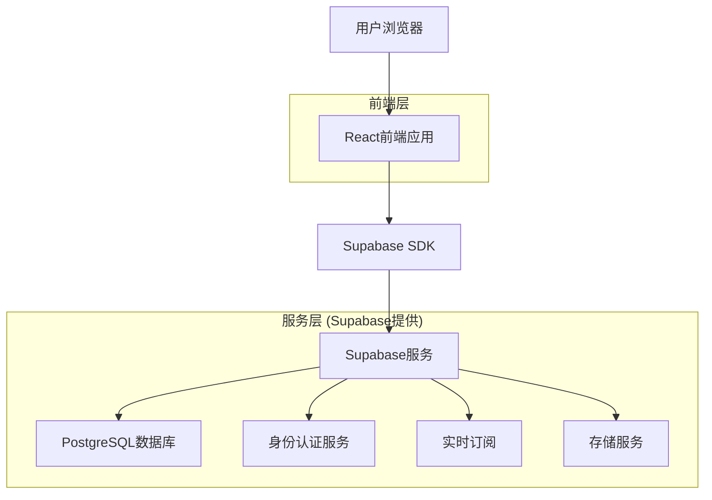
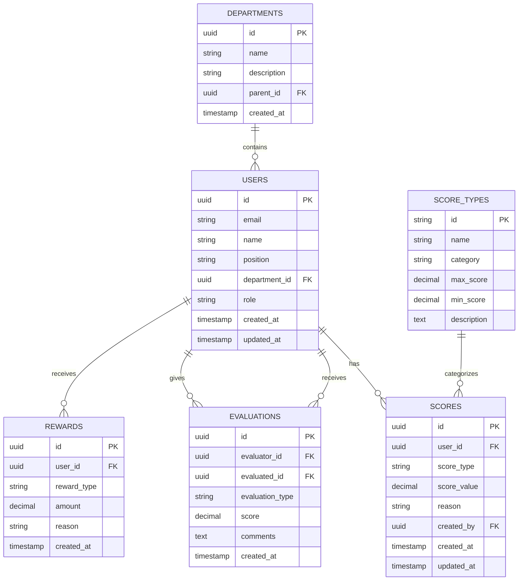

# 积分制绩效管理系统 - 技术架构文档

## 1. 架构设计



## 2. 技术描述

* **前端**: React\@18 + TypeScript + Ant Design\@5 + Vite + React Router\@6

* **后端**: Supabase (PostgreSQL + 身份认证 + 实时功能)

* **状态管理**: Zustand

* **图表库**: ECharts

* **样式**: CSS Modules + Ant Design

## 3. 路由定义

| 路由                | 用途                  |
| ----------------- | ------------------- |
| /login            | 登录页面，用户身份认证         |
| /dashboard        | 首页仪表板，显示积分概览和通知     |
| /score-management | 积分管理页面，四大积分模块的录入和管理 |
| /personnel        | 人员管理页面，职工信息和组织架构维护  |
| /evaluation       | 考核评价页面，日常评价和年终测评    |
| /statistics       | 统计报表页面，积分统计和数据分析    |
| /results          | 结果运用页面，绩效奖励和评优管理    |
| /settings         | 系统设置页面，考核配置和权限管理    |
| /profile          | 个人中心，个人信息和密码修改      |

## 4. API定义

### 4.1 核心API

**用户认证相关**

```
POST /auth/v1/token
```

请求:

| 参数名      | 参数类型   | 是否必需 | 描述   |
| -------- | ------ | ---- | ---- |
| email    | string | true | 用户邮箱 |
| password | string | true | 用户密码 |

响应:

| 参数名           | 参数类型   | 描述   |
| ------------- | ------ | ---- |
| access\_token | string | 访问令牌 |
| user          | object | 用户信息 |

**积分管理相关**

```
GET /rest/v1/scores
POST /rest/v1/scores
PATCH /rest/v1/scores
```

请求示例:

```json
{
  "user_id": "uuid",
  "score_type": "basic_duty",
  "score_value": 5,
  "reason": "考勤扣分",
  "created_by": "uuid"
}
```

**统计报表相关**

```
GET /rest/v1/rpc/get_score_statistics
GET /rest/v1/rpc/get_ranking_report
```

## 5. 数据模型

### 5.1 数据模型定义



### 5.2 数据定义语言

**用户表 (users)**

```sql
-- 创建用户表
CREATE TABLE users (
    id UUID PRIMARY KEY DEFAULT gen_random_uuid(),
    email VARCHAR(255) UNIQUE NOT NULL,
    name VARCHAR(100) NOT NULL,
    position VARCHAR(100),
    department_id UUID REFERENCES departments(id),
    role VARCHAR(20) DEFAULT 'employee' CHECK (role IN ('admin', 'evaluator', 'leader', 'employee')),
    created_at TIMESTAMP WITH TIME ZONE DEFAULT NOW(),
    updated_at TIMESTAMP WITH TIME ZONE DEFAULT NOW()
);

-- 创建索引
CREATE INDEX idx_users_department_id ON users(department_id);
CREATE INDEX idx_users_role ON users(role);
```

**部门表 (departments)**

```sql
-- 创建部门表
CREATE TABLE departments (
    id UUID PRIMARY KEY DEFAULT gen_random_uuid(),
    name VARCHAR(100) NOT NULL,
    description TEXT,
    parent_id UUID REFERENCES departments(id),
    created_at TIMESTAMP WITH TIME ZONE DEFAULT NOW()
);

-- 初始化数据
INSERT INTO departments (name, description) VALUES
('考核办公室', '负责绩效考核工作的统计汇总、督查通报'),
('养护科', '负责公路养护相关工作'),
('工程科', '负责工程建设相关工作'),
('办公室', '负责行政管理相关工作');
```

**积分表 (scores)**

```sql
-- 创建积分表
CREATE TABLE scores (
    id UUID PRIMARY KEY DEFAULT gen_random_uuid(),
    user_id UUID NOT NULL REFERENCES users(id),
    score_type VARCHAR(50) NOT NULL,
    score_value DECIMAL(5,2) NOT NULL,
    reason TEXT,
    created_by UUID REFERENCES users(id),
    created_at TIMESTAMP WITH TIME ZONE DEFAULT NOW(),
    updated_at TIMESTAMP WITH TIME ZONE DEFAULT NOW()
);

-- 创建索引
CREATE INDEX idx_scores_user_id ON scores(user_id);
CREATE INDEX idx_scores_type ON scores(score_type);
CREATE INDEX idx_scores_created_at ON scores(created_at DESC);
```

**积分类型表 (score\_types)**

```sql
-- 创建积分类型表
CREATE TABLE score_types (
    id VARCHAR(50) PRIMARY KEY,
    name VARCHAR(100) NOT NULL,
    category VARCHAR(50) NOT NULL,
    max_score DECIMAL(5,2),
    min_score DECIMAL(5,2),
    description TEXT
);

-- 初始化积分类型数据
INSERT INTO score_types (id, name, category, max_score, min_score, description) VALUES
('attendance', '考勤管理', 'basic_duty', 5, 0, '考核上班迟到、早退、旷工情况'),
('learning', '基础学习', 'basic_duty', 5, 0, '考核参加学习培训情况'),
('discipline', '工作纪律', 'basic_duty', 10, 0, '考核工作作风、纪律执行情况'),
('work_performance', '工作实绩', 'performance', 50, 0, '考核工作任务量和完成质效'),
('key_work', '重点工作', 'key_work', 20, 0, '考核重大项目和专项活动参与情况'),
('performance_bonus', '绩效奖励', 'bonus', 20, 0, '表彰加分、先进加分等奖励积分');
```

**评价表 (evaluations)**

```sql
-- 创建评价表
CREATE TABLE evaluations (
    id UUID PRIMARY KEY DEFAULT gen_random_uuid(),
    evaluator_id UUID NOT NULL REFERENCES users(id),
    evaluated_id UUID NOT NULL REFERENCES users(id),
    evaluation_type VARCHAR(50) NOT NULL,
    score DECIMAL(5,2) NOT NULL,
    comments TEXT,
    created_at TIMESTAMP WITH TIME ZONE DEFAULT NOW()
);

-- 创建索引
CREATE INDEX idx_evaluations_evaluator ON evaluations(evaluator_id);
CREATE INDEX idx_evaluations_evaluated ON evaluations(evaluated_id);
CREATE INDEX idx_evaluations_type ON evaluations(evaluation_type);
```

**奖励表 (rewards)**

```sql
-- 创建奖励表
CREATE TABLE rewards (
    id UUID PRIMARY KEY DEFAULT gen_random_uuid(),
    user_id UUID NOT NULL REFERENCES users(id),
    reward_type VARCHAR(50) NOT NULL,
    amount DECIMAL(10,2),
    reason TEXT,
    created_at TIMESTAMP WITH TIME ZONE DEFAULT NOW()
);

-- 创建索引
CREATE INDEX idx_rewards_user_id ON rewards(user_id);
CREATE INDEX idx_rewards_type ON rewards(reward_type);
```

**权限设置**

```sql
-- 为匿名用户授予基本读取权限
GRANT SELECT ON departments TO anon;
GRANT SELECT ON score_types TO anon;

-- 为认证用户授予完整权限
GRANT ALL PRIVILEGES ON users TO authenticated;
GRANT ALL PRIVILEGES ON departments TO authenticated;
GRANT ALL PRIVILEGES ON scores TO authenticated;
GRANT ALL PRIVILEGES ON score_types TO authenticated;
GRANT ALL PRIVILEGES ON evaluations TO authenticated;
GRANT ALL PRIVILEGES ON rewards TO authenticated;
```

**统计函数**

```sql
-- 创建积分统计函数
CREATE OR REPLACE FUNCTION get_score_statistics(user_uuid UUID)
RETURNS TABLE(
    basic_duty_score DECIMAL,
    performance_score DECIMAL,
    key_work_score DECIMAL,
    bonus_score DECIMAL,
    total_score DECIMAL
) AS $$
BEGIN
    RETURN QUERY
    SELECT 
        COALESCE(SUM(CASE WHEN score_type IN ('attendance', 'learning', 'discipline') THEN score_value ELSE 0 END), 0) as basic_duty_score,
        COALESCE(SUM(CASE WHEN score_type = 'work_performance' THEN score_value ELSE 0 END), 0) as performance_score,
        COALESCE(SUM(CASE WHEN score_type = 'key_work' THEN score_value ELSE 0 END), 0) as key_work_score,
        COALESCE(SUM(CASE WHEN score_type = 'performance_bonus' THEN score_value ELSE 0 END), 0) as bonus_score,
        COALESCE(SUM(score_value), 0) as total_score
    FROM scores 
    WHERE user_id = user_uuid;
END;
$$ LANGUAGE plpgsql;
```

