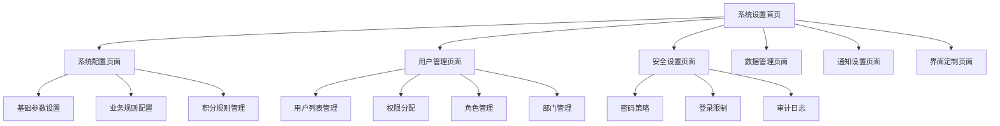

# 系统设置模块 - 产品需求文档

## 1. 产品概述

系统设置模块是积分制绩效管理系统的核心管理模块，为系统管理员和授权用户提供全面的系统配置、用户管理、安全控制和监控功能。该模块确保系统的稳定运行、数据安全和用户体验优化。

本模块主要解决系统配置管理、用户权限控制、系统监控和数据管理等关键问题，服务于系统管理员、部门管理员和高级用户，帮助他们高效管理和维护整个积分制绩效管理系统。

## 2. 核心功能

### 2.1 用户角色

| 角色 | 注册方法 | 核心权限 |
|------|----------|----------|
| 系统管理员 | 超级管理员分配 | 全部系统设置权限，包括用户管理、系统配置、安全设置等 |
| 部门管理员 | 系统管理员分配 | 部门用户管理、部门配置、部门数据查看 |
| 高级用户 | 部门管理员升级 | 个人设置、通知配置、界面定制 |

### 2.2 功能模块

我们的系统设置模块包含以下主要页面：

1. **系统配置页面**：基础参数设置、业务规则配置、积分规则管理
2. **用户管理页面**：用户列表、权限分配、角色管理、部门管理
3. **安全设置页面**：密码策略、登录限制、审计日志、权限控制
4. **数据管理页面**：数据备份、导入导出、数据清理、存储管理
5. **通知设置页面**：消息推送、邮件通知、提醒配置
6. **界面定制页面**：主题设置、布局配置、个性化选项

### 2.3 页面详情

| 页面名称 | 模块名称 | 功能描述 |
|----------|----------|----------|
| 系统配置页面 | 基础参数设置 | 配置系统基础参数，如系统名称、时区、语言等 |
| 系统配置页面 | 业务规则配置 | 设置积分计算规则、考核周期、评分标准等业务逻辑 |
| 系统配置页面 | 积分规则管理 | 管理各类积分的计算方式、权重分配、上限设置 |
| 用户管理页面 | 用户列表管理 | 查看、添加、编辑、删除用户信息，批量操作 |
| 用户管理页面 | 权限分配 | 为用户分配角色和权限，设置访问控制 |
| 用户管理页面 | 角色管理 | 创建和管理系统角色，定义角色权限 |
| 用户管理页面 | 部门管理 | 管理组织架构，设置部门层级和负责人 |
| 安全设置页面 | 密码策略 | 设置密码复杂度要求、有效期、历史限制 |
| 安全设置页面 | 登录限制 | 配置登录失败限制、IP白名单、会话超时 |
| 安全设置页面 | 审计日志 | 查看系统操作日志，追踪用户行为 |
| 系统监控页面 | 系统状态监控 | 实时显示系统运行状态、资源使用情况 |
| 系统监控页面 | 性能指标 | 监控系统性能指标，如响应时间、并发数等 |
| 系统监控页面 | 日志管理 | 查看和管理系统运行日志、错误日志 |
| 数据管理页面 | 数据备份 | 创建和管理数据备份，设置自动备份策略 |
| 数据管理页面 | 导入导出 | 批量导入导出用户数据、积分数据等 |
| 数据管理页面 | 数据清理 | 清理过期数据、临时文件、日志文件 |
| 通知设置页面 | 消息推送配置 | 设置系统消息推送规则和模板 |
| 通知设置页面 | 邮件通知设置 | 配置邮件服务器、通知模板、发送规则 |
| 界面定制页面 | 主题设置 | 选择和配置系统主题、颜色方案 |
| 界面定制页面 | 布局配置 | 自定义页面布局、菜单结构、组件显示 |

## 3. 核心流程

**系统管理员流程：**
系统管理员登录后，可以访问所有系统设置功能。首先进入系统配置页面查看和调整基础参数，然后通过用户管理页面管理用户账户和权限，接着在安全设置页面配置安全策略，最后通过系统监控页面查看系统运行状态。

**部门管理员流程：**
部门管理员登录后，主要使用用户管理页面管理本部门用户，通过通知设置页面配置部门通知，在界面定制页面个性化设置界面。

**高级用户流程：**
高级用户主要使用界面定制页面进行个人设置，通过通知设置页面配置个人通知偏好。

## 4. 用户界面设计

### 4.1 设计风格

- **主色调**：#1890ff（蓝色）作为主色，#52c41a（绿色）作为成功色，#ff4d4f（红色）作为警告色
- **辅助色**：#f0f2f5（浅灰）作为背景色，#ffffff（白色）作为卡片背景
- **按钮样式**：圆角按钮设计，主要按钮使用渐变效果，次要按钮使用边框样式
- **字体**：主要使用 14px 字体，标题使用 16-20px，小字使用 12px
- **布局风格**：卡片式布局，左侧导航菜单，顶部面包屑导航
- **图标风格**：使用 Ant Design 图标库，统一的线性图标风格

### 4.2 页面设计概览

| 页面名称 | 模块名称 | UI元素 |
|----------|----------|--------|
| 系统配置页面 | 基础参数设置 | 表单布局，输入框、选择器、开关组件，保存按钮，重置按钮 |
| 系统配置页面 | 业务规则配置 | 标签页布局，数值输入框、滑块组件、规则编辑器 |
| 用户管理页面 | 用户列表管理 | 表格组件，搜索框、筛选器、批量操作按钮，分页组件 |
| 用户管理页面 | 权限分配 | 树形选择器，权限矩阵表格，角色标签，确认对话框 |
| 安全设置页面 | 密码策略 | 表单组件，强度指示器，规则说明文本，实时验证提示 |
| 数据管理页面 | 数据备份 | 时间线组件，进度条，操作按钮组，状态标签 |
| 通知设置页面 | 消息推送配置 | 开关组件，模板编辑器，预览面板，测试发送按钮 |
| 界面定制页面 | 主题设置 | 颜色选择器，预览面板，主题卡片，应用按钮 |

### 4.3 响应式设计

系统采用移动优先的响应式设计策略，支持桌面端、平板端和移动端访问。在移动端，侧边栏菜单将折叠为抽屉式导航，表格组件支持横向滚动，表单布局自动调整为单列显示。同时优化触摸交互体验，增大按钮点击区域，提供手势操作支持。