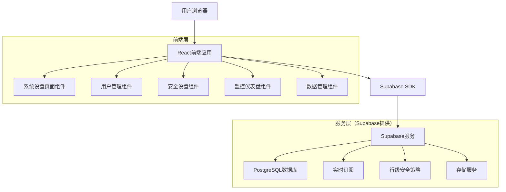
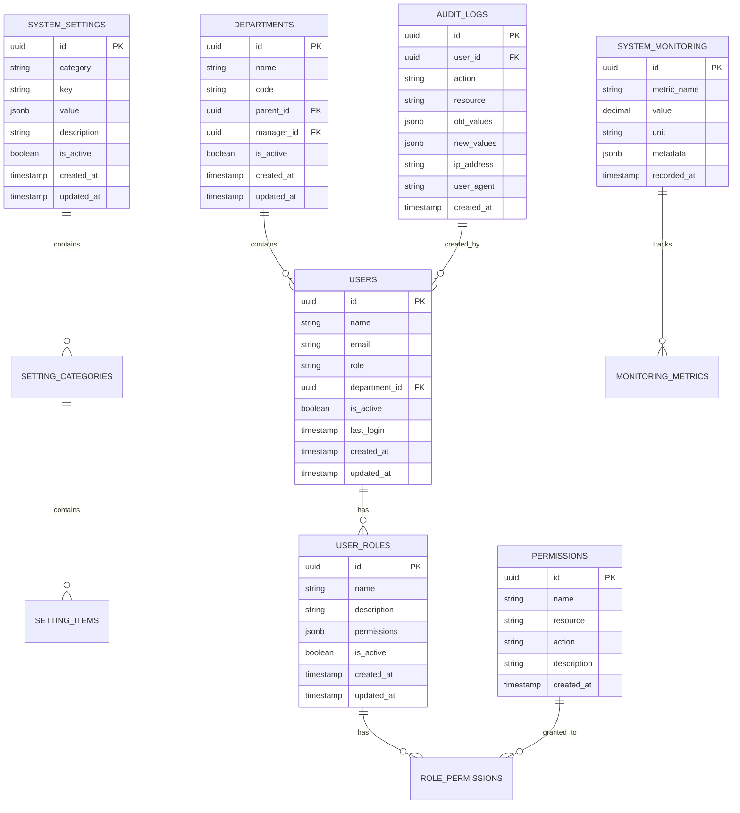

# 系统设置模块 - 技术架构文档

## 1. 架构设计



## 2. 技术描述

- **前端**：React@18 + TypeScript + Ant Design@5 + Vite
- **后端**：Supabase（PostgreSQL + 实时API + 认证服务）
- **状态管理**：Zustand
- **路由**：React Router@6
- **样式**：Tailwind CSS + Ant Design
- **图表**：Recharts
- **表单验证**：React Hook Form + Zod

## 3. 路由定义

| 路由 | 用途 |
|------|------|
| /settings | 系统设置主页，显示设置概览和快捷入口 |
| /settings/system | 系统配置页面，管理基础参数和业务规则 |
| /settings/users | 用户管理页面，管理用户、角色和权限 |
| /settings/security | 安全设置页面，配置安全策略和审计 |
| /settings/monitoring | 系统监控页面，查看系统状态和性能 |
| /settings/data | 数据管理页面，处理备份、导入导出 |
| /settings/notifications | 通知设置页面，配置消息和邮件通知 |
| /settings/appearance | 界面定制页面，设置主题和布局 |

## 4. API定义

### 4.1 核心API

**系统配置相关**
```
GET /api/settings/system
```
获取系统配置信息

请求参数：无

响应：
| 参数名称 | 参数类型 | 描述 |
|----------|----------|------|
| system_name | string | 系统名称 |
| timezone | string | 系统时区 |
| language | string | 默认语言 |
| score_rules | object | 积分规则配置 |

```
PUT /api/settings/system
```
更新系统配置

请求：
| 参数名称 | 参数类型 | 是否必需 | 描述 |
|----------|----------|----------|------|
| system_name | string | false | 系统名称 |
| timezone | string | false | 系统时区 |
| language | string | false | 默认语言 |
| score_rules | object | false | 积分规则配置 |

响应：
| 参数名称 | 参数类型 | 描述 |
|----------|----------|------|
| success | boolean | 操作是否成功 |
| message | string | 操作结果消息 |

**用户管理相关**
```
GET /api/settings/users
```
获取用户列表

请求参数：
| 参数名称 | 参数类型 | 是否必需 | 描述 |
|----------|----------|----------|------|
| page | number | false | 页码，默认1 |
| limit | number | false | 每页数量，默认20 |
| search | string | false | 搜索关键词 |
| role | string | false | 角色筛选 |

响应：
| 参数名称 | 参数类型 | 描述 |
|----------|----------|------|
| users | array | 用户列表 |
| total | number | 总数量 |
| page | number | 当前页码 |

```
POST /api/settings/users
```
创建新用户

请求：
| 参数名称 | 参数类型 | 是否必需 | 描述 |
|----------|----------|----------|------|
| name | string | true | 用户姓名 |
| email | string | true | 邮箱地址 |
| role | string | true | 用户角色 |
| department_id | string | true | 部门ID |

**权限管理相关**
```
GET /api/settings/permissions
```
获取权限列表

```
PUT /api/settings/users/{userId}/permissions
```
更新用户权限

**系统监控相关**
```
GET /api/settings/monitoring/status
```
获取系统状态

```
GET /api/settings/monitoring/logs
```
获取系统日志

示例响应：
```json
{
  "status": "healthy",
  "uptime": 86400,
  "cpu_usage": 45.2,
  "memory_usage": 67.8,
  "disk_usage": 23.1,
  "active_users": 156
}
```

## 5. 数据模型

### 5.1 数据模型定义



### 5.2 数据定义语言

**系统设置表 (system_settings)**
```sql
-- 创建系统设置表
CREATE TABLE system_settings (
    id UUID PRIMARY KEY DEFAULT gen_random_uuid(),
    category VARCHAR(50) NOT NULL,
    key VARCHAR(100) NOT NULL,
    value JSONB NOT NULL,
    description TEXT,
    is_active BOOLEAN NOT NULL DEFAULT true,
    created_at TIMESTAMP WITH TIME ZONE DEFAULT NOW(),
    updated_at TIMESTAMP WITH TIME ZONE DEFAULT NOW(),
    UNIQUE(category, key)
);

-- 创建索引
CREATE INDEX idx_system_settings_category ON system_settings(category);
CREATE INDEX idx_system_settings_key ON system_settings(key);
CREATE INDEX idx_system_settings_active ON system_settings(is_active);

-- 初始化数据
INSERT INTO system_settings (category, key, value, description) VALUES
('system', 'name', '"积分制绩效管理系统"', '系统名称'),
('system', 'timezone', '"Asia/Shanghai"', '系统时区'),
('system', 'language', '"zh-CN"', '默认语言'),
('score', 'max_daily_score', '100', '每日最大积分'),
('score', 'evaluation_period', '"monthly"', '考核周期'),
('security', 'password_min_length', '8', '密码最小长度'),
('security', 'login_attempt_limit', '5', '登录尝试次数限制'),
('notification', 'email_enabled', 'true', '是否启用邮件通知');
```

**用户角色表 (user_roles)**
```sql
-- 创建用户角色表
CREATE TABLE user_roles (
    id UUID PRIMARY KEY DEFAULT gen_random_uuid(),
    name VARCHAR(50) NOT NULL UNIQUE,
    description TEXT,
    permissions JSONB NOT NULL DEFAULT '[]',
    is_active BOOLEAN NOT NULL DEFAULT true,
    created_at TIMESTAMP WITH TIME ZONE DEFAULT NOW(),
    updated_at TIMESTAMP WITH TIME ZONE DEFAULT NOW()
);

-- 创建索引
CREATE INDEX idx_user_roles_name ON user_roles(name);
CREATE INDEX idx_user_roles_active ON user_roles(is_active);

-- 初始化角色数据
INSERT INTO user_roles (name, description, permissions) VALUES
('system_admin', '系统管理员', '["system:*", "user:*", "security:*", "monitoring:*"]'),
('department_admin', '部门管理员', '["user:read", "user:write", "department:*"]'),
('advanced_user', '高级用户', '["profile:*", "notification:*", "appearance:*"]');
```

**权限表 (permissions)**
```sql
-- 创建权限表
CREATE TABLE permissions (
    id UUID PRIMARY KEY DEFAULT gen_random_uuid(),
    name VARCHAR(100) NOT NULL UNIQUE,
    resource VARCHAR(50) NOT NULL,
    action VARCHAR(50) NOT NULL,
    description TEXT,
    created_at TIMESTAMP WITH TIME ZONE DEFAULT NOW()
);

-- 创建索引
CREATE INDEX idx_permissions_resource ON permissions(resource);
CREATE INDEX idx_permissions_action ON permissions(action);

-- 初始化权限数据
INSERT INTO permissions (name, resource, action, description) VALUES
('system:read', 'system', 'read', '查看系统设置'),
('system:write', 'system', 'write', '修改系统设置'),
('user:read', 'user', 'read', '查看用户信息'),
('user:write', 'user', 'write', '管理用户'),
('security:read', 'security', 'read', '查看安全设置'),
('security:write', 'security', 'write', '修改安全设置'),
('monitoring:read', 'monitoring', 'read', '查看监控数据');
```

**审计日志表 (audit_logs)**
```sql
-- 创建审计日志表
CREATE TABLE audit_logs (
    id UUID PRIMARY KEY DEFAULT gen_random_uuid(),
    user_id UUID REFERENCES users(id),
    action VARCHAR(100) NOT NULL,
    resource VARCHAR(100) NOT NULL,
    old_values JSONB,
    new_values JSONB,
    ip_address INET,
    user_agent TEXT,
    created_at TIMESTAMP WITH TIME ZONE DEFAULT NOW()
);

-- 创建索引
CREATE INDEX idx_audit_logs_user_id ON audit_logs(user_id);
CREATE INDEX idx_audit_logs_action ON audit_logs(action);
CREATE INDEX idx_audit_logs_resource ON audit_logs(resource);
CREATE INDEX idx_audit_logs_created_at ON audit_logs(created_at DESC);
```

**系统监控表 (system_monitoring)**
```sql
-- 创建系统监控表
CREATE TABLE system_monitoring (
    id UUID PRIMARY KEY DEFAULT gen_random_uuid(),
    metric_name VARCHAR(100) NOT NULL,
    value DECIMAL(10,2) NOT NULL,
    unit VARCHAR(20),
    metadata JSONB,
    recorded_at TIMESTAMP WITH TIME ZONE DEFAULT NOW()
);

-- 创建索引
CREATE INDEX idx_system_monitoring_metric ON system_monitoring(metric_name);
CREATE INDEX idx_system_monitoring_recorded_at ON system_monitoring(recorded_at DESC);

-- 授权给anon和authenticated角色
GRANT SELECT ON system_settings TO anon, authenticated;
GRANT ALL PRIVILEGES ON system_settings TO authenticated;
GRANT SELECT ON user_roles TO anon, authenticated;
GRANT ALL PRIVILEGES ON user_roles TO authenticated;
GRANT SELECT ON permissions TO anon, authenticated;
GRANT ALL PRIVILEGES ON audit_logs TO authenticated;
GRANT SELECT ON system_monitoring TO anon, authenticated;
GRANT ALL PRIVILEGES ON system_monitoring TO authenticated;
```